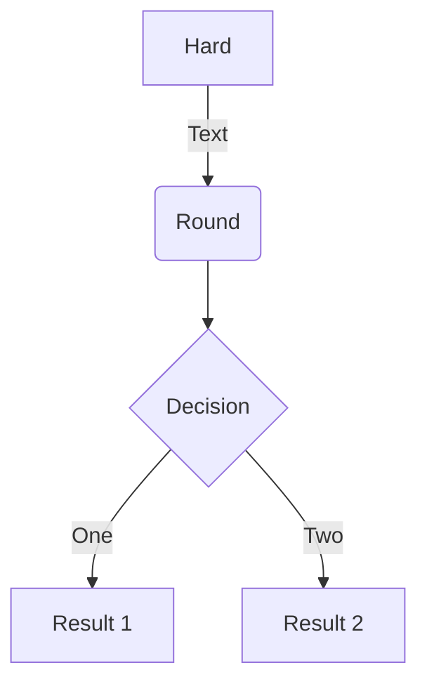
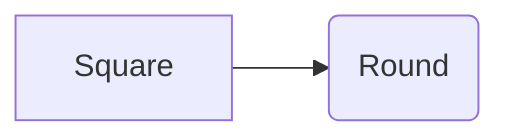
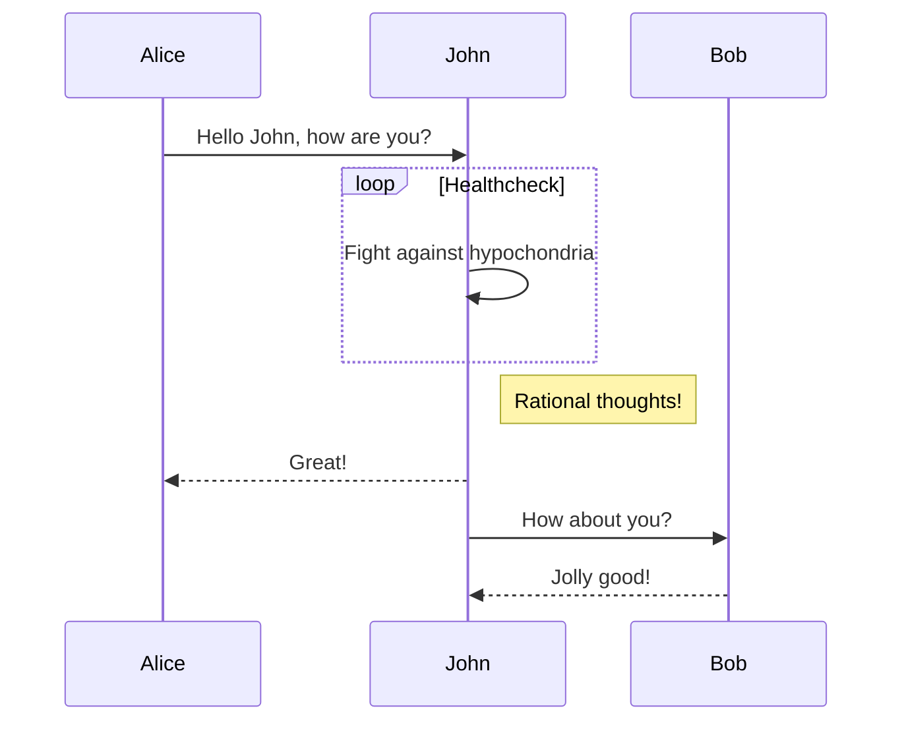
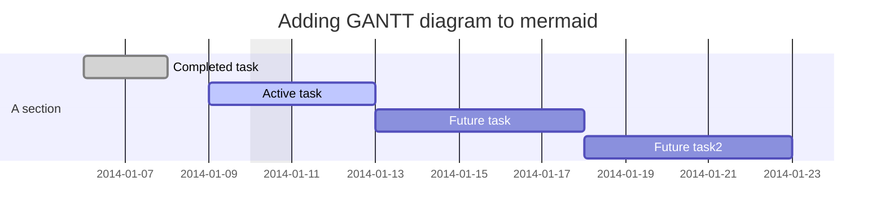
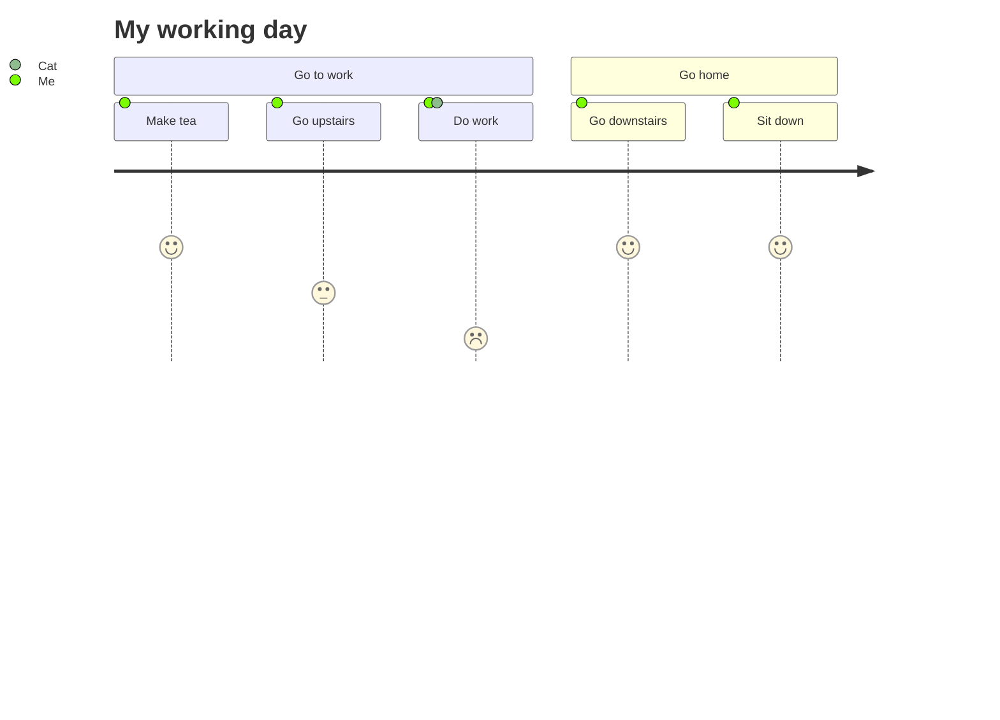

 {}
`r` for scholarly writing: creation of diagrams, gantt charts,tables etc. 
{}


`r` is designed to give technical content creators a seamless experience. This allow us to focus on the content

{}
**With r you can take notes on classes including math, cite as you write, analyze data, pull out results and automatically attach inline,make slide shows, draw diagrams from textual representation and many more.**
{}

On this page, you'll find some examples of the following types of technical content that can be rendered with `r`.


+ Math
+ Flow charts
+ Gantt chart
+ to do list
+ Tables
+ Callouts
+ Spoilers


## Examples

### Math

To render *inline* or *block* math, wrap your LaTeX math with `$...$` or `$$...$$`, respectively.

```
$ E= MC^2 $
```
$ E= MC^2 $

### Diagrams

`r`  supports a Markdown extension for diagrams.

An example **flowchart**:

    ```mermaid
    graph TD
    A[Hard] -->|Text| B(Round)
    B --> C{Decision}
    C -->|One| D[Result 1]
    C -->|Two| E[Result 2]
    ```

renders as



    ```mermaid
    graph LR
    A[Square] --> B(Round)
    ```
render as 

An example **sequence diagram**:

    ```mermaid
    sequenceDiagram
    Alice->>John: Hello John, how are you?
    loop Healthcheck
        John->>John: Fight against hypochondria
    end
    Note right of John: Rational thoughts!
    John-->>Alice: Great!
    John->>Bob: How about you?
    Bob-->>John: Jolly good!
    ```

renders as



An example **Gantt diagram**:

    ```mermaid
    gantt
    dateFormat  YYYY-MM-DD
    title Adding GANTT diagram to mermaid
    excludes weekdays 2014-01-10

    section A section
    Completed task            :done,    des1, 2014-01-06,2014-01-08
    Active task               :active,  des2, 2014-01-09, 3d
    Future task               :         des3, after des2, 5d
    Future task2               :         des4, after des3, 5d
    ```



     ```mermaid
    journey
    title My working day
    section Go to work
    Make tea: 5: Me
    Go upstairs: 3: Me
    Do work: 1: Me, Cat
    section Go home
      Go downstairs: 5: Me
      Sit down: 5: Me
      ```
      

      
      

### Todo lists

You can even write your todo lists in Academic too:

```markdown
- [x] Write math example
- [x] Write diagram example
- [ ] Do something else
```

renders as

- [x] Write math example
- [x] Write diagram example
- [ ] Do something else

### Tables

Represent your data in tables:

```markdown
| First Header  | Second Header |
| ------------- | ------------- |
| Content Cell  | Content Cell  |
| Content Cell  | Content Cell  |
```

renders as

| First Header  | Second Header |
| ------------- | ------------- |
| Content Cell  | Content Cell  |
| Content Cell  | Content Cell  |

### Callouts

Also referred to as *asides*, *hints*, or *alerts*. By wrapping a paragraph in `{} ... {}`, it will render as an aside.

```markdown
{}
A Markdown aside is useful for displaying notices, hints, or definitions to your readers.
{}
```

renders as

{}
A Markdown aside is useful for displaying notices, hints, or definitions to your readers.
{}

### Spoilers

Add a spoiler to a page to reveal text, such as an answer to a question, after a button is clicked.

```markdown

You found me!

```

renders as

 You found me! 

NB: always remember this git command: <mark>git reset HEAD~n</mark> (where n is the number of commits to revert)


